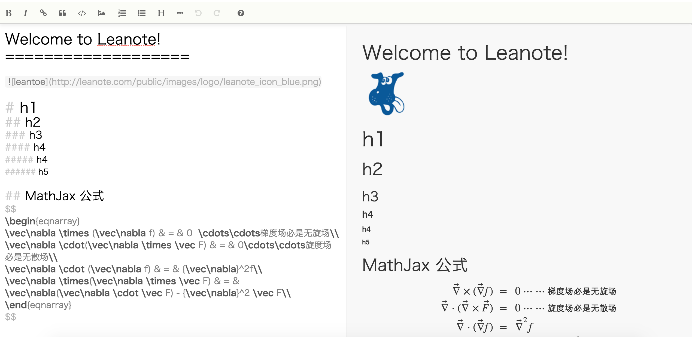

# Markdown Editor For Leanote Desktop App

Leanote's Markdown Editor originally forked from [Stackedit](https://github.com/benweet/stackedit). The Stackedit source is under an Apache License (http://www.apache.org/licenses/LICENSE-2.0) and The code updated by Leanote is under GPL v2.

## Branches

* [master](https://github.com/leanote/desktop-app) Markdown Editor For [Leanote](https://github.com/leanote/leanote)
* [desktop-app](https://github.com/leanote/markdown-editor/tree/desktop-app) Markdown Editor For [Leanote Desktop App](https://github.com/leanote/desktop-app)
* [ios](https://github.com/leanote/markdown-editor/tree/ios) Markdown Editor For [Leanote iOS](https://github.com/leanote/desktop-ios)

## Build

Please install `node` and `gulp` firstly.

```
> gulp # build res-min/main.js (https://github.com/leanote/leanote/blob/master/public/dist/main.js)
> gulp minify # compress main.js to main.min.js (https://github.com/leanote/leanote/blob/master/public/dist/main.min.js)
```

## Local Debug

```
> node server.js
```

See: http://localhost:3000/editor.html



## Main Files

* main.js [Entry]
* editor.js [Main]
* core.js [Core]
* lib/Markdown.Editor.js [Markdown Core]

## Integrated With Leanote Desktop App 使用
copy res-min/main.js to leanote-dekstop-app's path `/public/md/`

----------------------------

## 构建

确保在此之前安装了node, gulp

```
> gulp # 生成res-min/main.js (https://github.com/leanote/desktop-app/blob/master/public/md/main.js)
> gulp minify # 压缩main.js -> main.min.js (https://github.com/leanote/desktop-app/blob/master/public/md/main.min.js)
```

## 本地调试

```
> node server.js
```

访问: http://localhost:3000/editor.html


## 主要文件

* main.js 入口
* editor.js [主要]
* core.js [主要]
* lib/Markdown.Editor.js [主要]

## Leanote Desktop App 使用 Markdown 编辑器

将 res-min/main.js 复制到 leanote-dekstop-app 的 `/public/md/` 下
